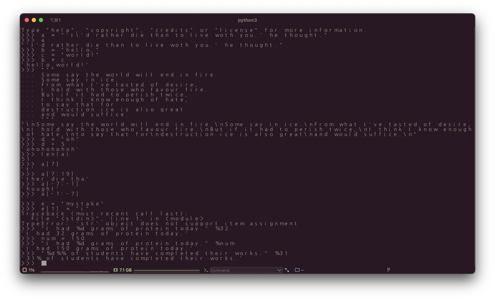

# 241015

<figure><figcaption></figcaption></figure>

02 - 2

1번 section 에 있던 숫자형 자료의 경우 단순 사칙연산이나 파생되는 제곱, 모듈러 연산이라 간단하게 코드 작성만 하고 넘겼다.

문자열 자료형의 경우 특징들이 꽤 있었다.

* 기본적으로 큰/작은 따옴표를 통해 string 작성
* string 내 따옴표 작성 시, 내용에 포함될 따옴표와 다른 따옴표를 통해 둘러싸주거나
* escape code(\\' 또는 \\") 를 통해 작성
* 줄 바꿈, 탭 또한 escape code 를 사용하거나 세번의 연속된 따옴표 사용(''' ''', """ """)
* string 도 연산의 대상이 될 수 있으며
* string 끼리 더할 수도 있다.

그 외에도 문자열 길이 함수 len( ), indexing, slicing, formatting 을 학습했다.

***

꾸준히 공부하고 review 를 작성해야 하는데 요새 일이 너무 많아서 뜸했다.

다시 열심히!

🍻
