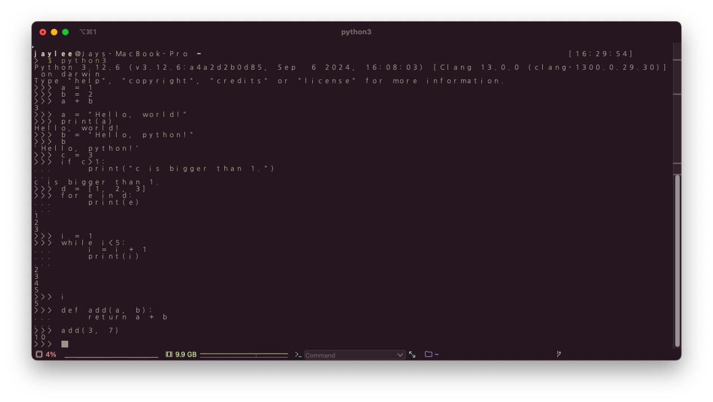
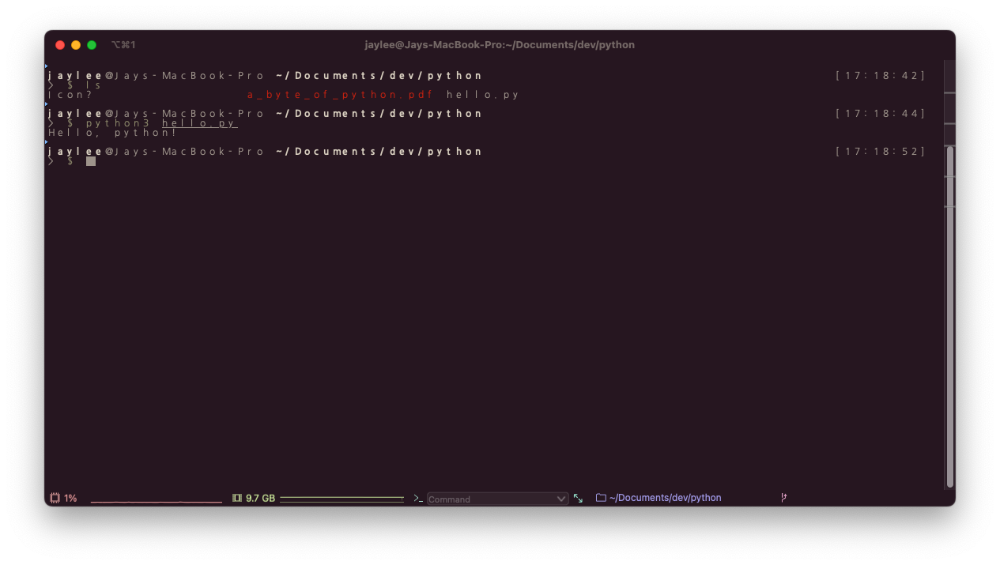

# 240923

01 - 1 \~ 01 -3

python 의 특징

* 공동 작업과 유지 보수가 편리하다.
* 다른 언어로 작성된 프로그램을 포함시켜 단점을 보완할 수 있다.
* uses indentations, not brackets
* 웹 개발, 인공지능과 머신러닝(사이킷런, 텐서플로, 파이토치, 케라스 등), 수치 연산(NumPy), 데이터 분석(NumPy, Pandas, Matplotlib) 등 다양한 분야에서 활용된다.
* 다만, 운영체제, 고반복 연산, 모바일 프로그래밍에는 적합하지 않다.

***

01 - 4 \~ 01 - 5

python 설치와 기본 문법

<figure><figcaption></figcaption></figure>

***

01 - 6

작성한 python 파일을 terminal 에서 직접 실행하기

<figure><figcaption>
directory 는 미리 이동해놨다.
</figcaption></figure>
